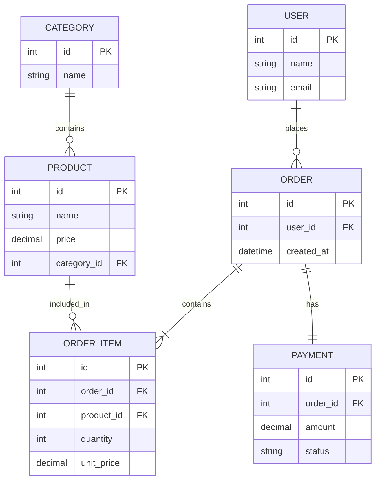

# ER-модель онлайн-магазину

## Mermaid ER-діаграма

## Опис зв'язків

- `User 1:N Order` — один користувач може створити багато замовлень.
- `Category 1:N Product` — одна категорія може містити багато товарів.
- `Order 1:N OrderItem` — одне замовлення містить одну або більше позицій.
- `Product 1:N OrderItem` — один товар може зустрічатися в багатьох позиціях замовлень.
- `Order 1:1 Payment` — кожне замовлення має один платіж.

`OrderItem` є асоціативною сутністю між `Order` та `Product`, оскільки зв'язок має власні атрибути `quantity` та `unit_price`.